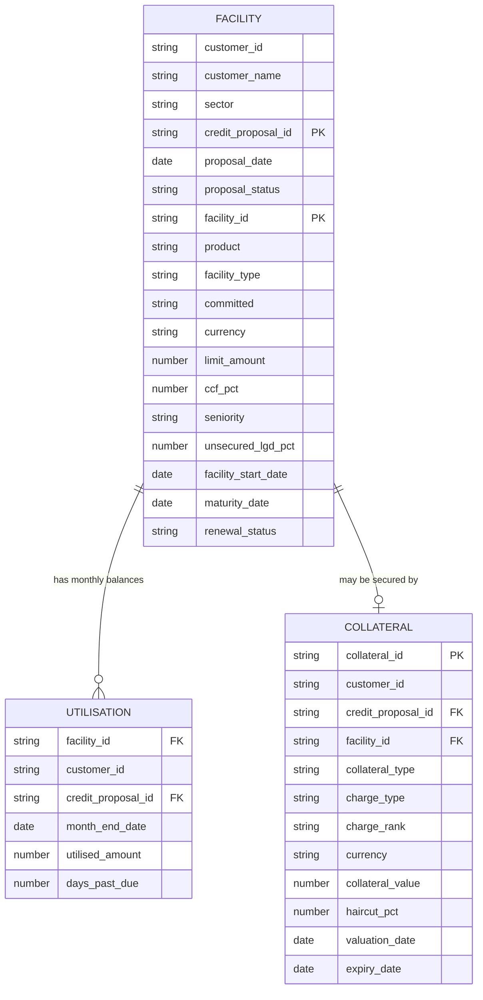
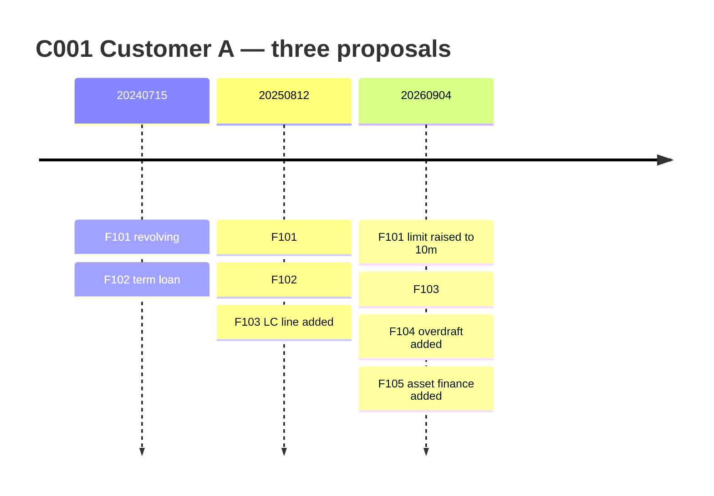

# AI-Powered Limits & Exposure Snapshot + Early Warning Narrative

A Prompt-A-Thon entry. The goal is to turn three raw credit tables into a one-page
exposure snapshot, a trend view, rule-based early warning flags, and a plain-English
"so what" narrative — using a prompt alone, with no code execution.

> All data in this repository is **synthetic**. It was invented for this exercise.
> It contains no real customer, no real bank data, and no production logic.
> Haircuts, CCFs and LGD rates are illustrative assumptions, not policy.

---

## 1. The use case

| | |
|---|---|
| **Scenario** | Risk partners need a fast, consistent view of a client's limits, utilisation, upcoming maturities and early warning signals, without manually stitching together multiple datasets and commentary. |
| **Input** | Synthetic structured risk/exposure data: limits and utilisation by facility, collateral and coverage metrics, and a facility maturity ladder for the next 3–12 months. |
| **Expected output** | One-page exposure snapshot (totals + breakdowns), trend highlights with notable drivers, early warning flags with rationale, and a "so what" impact summary covering refinancing and liquidity risk. |

### Scope decision

**In scope:** EAD, collateral coverage, LGD, loss severity, maturity, early warning flags.

All amounts are in USD. Customer names are placeholders (Customer A to G) so that
nothing in the dataset reads as a real client.

**Out of scope:** internal ratings, PD, expected loss, regulatory capital and RWA.

This matters. Expected loss needs all three parameters:

```
Expected loss = PD x LGD x EAD
```

Without PD we cannot answer *how likely* a default is, so the output answers
*how bad it would be* instead:

```
Loss severity = LGD x EAD
```

That is a legitimate number and it is fully derivable from the data in this repo,
with every step checkable by hand. The prompt must state this scope explicitly,
or the model will invent a rating and a probability.

---

## 2. Glossary

Plain-money definitions for the terms used throughout.

| Term | What it means in money |
|---|---|
| **Limit** | The maximum the bank has approved. Nothing has necessarily moved. |
| **Utilised** | What the customer is actually using right now. For contingent facilities this is the amount *issued*, not cash lent. |
| **Headroom / undrawn** | Limit minus utilised. Promised but not yet taken. |
| **Committed** | The bank is legally obliged to lend the undrawn part on demand. |
| **Uncommitted** | The bank can refuse. Overdrafts usually are. |
| **Revolving** | Take it, repay it, take it again, up to the limit. A credit card. |
| **Term** | Handed over once, repaid to a schedule. Balance only falls. A mortgage. |
| **Contingent** | No bank cash has moved. The bank has promised a third party it will pay if the customer does not. Becomes real money only if called. |
| **CCF** | Credit conversion factor. The share of undrawn headroom assumed to be drawn before default. |
| **EAD** | Exposure at default. The pounds expected to be owed at the moment of failure. |
| **Collateral** | The asset pledged: property, cash, receivables, vehicles. |
| **Charge (fixed / floating)** | The legal claim over that asset. Fixed is locked to a named asset and recovers well. Floating sits over whatever exists at the time and recovers badly. |
| **Haircut** | The discount applied to a valuation before it counts. USD 10m of property at a 35% haircut counts as USD 6.5m. |
| **Coverage** | Collateral value divided by utilised amount. |
| **Unsecured LGD** | The loss rate on the part of the exposure collateral does not cover. Around 45% for senior unsecured corporate lending. |
| **Seniority** | Who gets paid first from recoveries. Senior ranks ahead of subordinated, so subordinated LGD is much higher. |
| **Loss severity** | (EAD − collateral after haircut) × unsecured LGD. |
| **Credit proposal** | An application or review. Everything in this model is versioned by it. |

---

## 3. Data model

Three tables. The credit proposal is the version key that ties them together.



### How the credit proposal works

This is the part that makes the dataset realistic, and the part a naive prompt
gets wrong.

- A customer raises **many credit proposals over time**. The ID encodes the
  application date: an application on 15 July 2024 becomes `20240715`.
- **Each proposal lists every facility live for that customer at that moment** —
  not only the ones that changed.
- A **facility keeps the same ID for life**. It reappears on each proposal until
  it matures, then stops appearing.
- Therefore **the latest proposal is the complete current book**, and comparing
  it with the previous proposal gives the trend.



F102 is absent from the third proposal because it matured on 31 July 2026.
Its monthly balances stop at the same point. The two facts must agree.

### Why the tables are split this way

| Fact | Where it lives | Why |
|---|---|---|
| Limit | Facility | Changes only when a proposal changes it, so it belongs with the terms. Repeating it monthly invites contradictions. |
| Utilised amount | Utilisation | Moves every month. |
| Days past due | Utilisation | Behavioural and monthly, like the balance. |
| Haircut | Collateral | An attribute of the pledged asset. |
| Seniority, unsecured LGD | Facility | Applies whether or not collateral exists. A facility with no collateral still needs an LGD. |
| Credit proposal ID | All three | Denormalised onto Utilisation deliberately, so each balance can be matched to the limit in force that month without date-range logic. |

### Collateral rules

- **At most one collateral row per facility.** A term loan has one, because the
  asset being financed secures itself. A credit card, overdraft or revolving line
  has none. Contingent facilities vary: a guarantee line is often cash-backed, a
  trade LC for a strong customer is often clean.
- **The analysis never reasons about whether a facility type *should* have
  security.** It reads whether a collateral row exists, and treats the facility as
  unsecured if none does.
- **A facility with no collateral row is unsecured** and takes the full unsecured
  LGD from the facility row.
- **Expiry date matters.** It is blank for collateral that does not expire, such
  as property. Where it is populated, collateral expiring before the facility
  matures should not be relied on.
- **Valuation date matters.** A property valued two years ago is not worth its
  stated value today, and the narrative should caveat it.

---

## 4. Calculation logic

### EAD

| Facility type | Formula |
|---|---|
| Term | `EAD = utilised` |
| Revolving, committed | `EAD = utilised + (ccf_pct x (limit − utilised))` |
| Revolving, uncommitted | `EAD = utilised` (the bank can refuse further drawing) |
| Contingent (guarantee) | `EAD = issued x 100%` |
| Contingent (LC line) | `EAD = issued x 20%` |

The CCF is on the facility row, so the prompt reads it rather than assuming it.

### LGD and loss severity

```
collateral_after_haircut = collateral_value x (1 − haircut_pct)
covered                  = min(EAD, collateral_after_haircut)
uncovered                = EAD − covered
loss_severity            = uncovered x unsecured_lgd_pct
LGD                      = loss_severity / EAD
```

Collateral is counted **only** if it has no expiry date, or its expiry date falls
after the facility maturity date.

Note the two stacked recoveries: the covered portion is recovered by selling the
asset, and the uncovered portion still recovers roughly 55% from the insolvency.
That is why unsecured LGD is 45% and not 100%.

### Convention chosen

Collateral reduces **LGD**. EAD stays gross. The alternative convention — where
collateral reduces EAD directly and LGD stays flat — is equally valid, but the two
must never be combined, or the benefit is double-counted.

### Early warning rules

| Rule | Level | Condition |
|---|---|---|
| High utilisation | Facility | Latest utilisation ÷ limit > 85%, revolving and contingent only |
| Utilisation spike | Facility | Utilisation up more than 10pp month on month |
| Excess over limit | Facility | Utilised > limit |
| Arrears | Facility | Days past due > 0 |
| Maturity without renewal | Facility | Matures within 90 days and renewal status is not "Agreed" |
| Collateral shortfall | Facility | Collateral value ÷ utilised < 100%, where collateral exists |
| Collateral expiry gap | Facility | Collateral expires before the facility matures |

Rules use collateral value **before** haircut. Haircuts are used only in the
recovery maths, so the two views stay separable.

Utilisation rules apply to revolving and contingent facilities only. Term loans
are near fully drawn by design, so a high percentage there is normal, not a warning.

Maturity is a **reporting and early warning dimension only**. It does not change
EAD or LGD. It feeds the regulatory capital formula, which is out of scope here.

---

## 5. What is in the data

`data/` holds the raw tables only: plain headers, ISO dates, no formatting.

| File | Use |
|---|---|
| `facility.csv`, `utilisation.csv`, `collateral.csv` | The three tables. Attach these. |
| `credit_exposure_inputs_raw.xlsx` | The same data on three sheets, for tools that prefer Excel. |

| Table | Rows | Grain |
|---|---|---|
| facility | 36 | customer x credit proposal x facility |
| utilisation | 218 | facility x month-end |
| collateral | 22 | facility x credit proposal, at most one |

Twenty-four month-ends, Oct-2024 to Sep-2026. The as-at date is not fixed anywhere; the prompt takes it from the latest month-end in the utilisation table. All amounts are in USD. Customer names are placeholders.
Seven customers, fourteen credit proposals, nineteen facilities.

Every approved proposal has utilisation rows for the months it was in force. The
one Pending proposal has none, by design: balances belong to approved limits.

### The seven customers

| Customer | Proposals | Expected RAG | Purpose |
|---|---|---|---|
| **C001 Customer A** | 3 | Red | RCF at 95% and unsecured, arrears, expired-then-replaced LC security, an overdraft maturing in 76 days |
| **C002 Customer B** | 2 | Amber | Clean book, one guarantee line maturing in 81 days with renewal in progress |
| **C003 Customer C** | 1 | Red | LC line over its limit. Single proposal, so no trend exists |
| **C004 Customer D** | 3 (one Pending) | Red | Arrears at 90 days, a facility past maturity still drawn, a zero-utilisation committed line |
| **C005 Customer E** | 1 | Green | Deleveraging, fully covered, but a missing month and a 2019 valuation |
| **C006 Customer F** | 2 | Green | Stable and well covered. The control customer |
| **C007 Customer G** | 2 | Amber | A 28pp utilisation spike that stays below 85%, plus a collateral shortfall |

Three Red, two Amber, two Green.

### Planted signals

- **F101** climbs to 95% in the same month its limit rises from USD 8m to USD 10m.
  Unsecured, so it carries the largest loss severity in the book at USD 4.4m.
- **F302** is utilised USD 2.1m against a USD 2.0m limit, an excess.
- **F404** shows arrears escalating 30, 60 then 90 days across three months.
- **F701** jumps 28 percentage points but ends at 78%, below the 85% threshold. It
  must raise a spike flag and **not** a high-utilisation flag.
- **F501** is deleveraging from USD 5.0m to USD 3.0m. Improvement must be reported
  as readily as deterioration.
- **F202** is flat at USD 2.4m for eighteen months. Any trend reported there is a
  false positive.

### Traps and edge cases

| # | What is in the data | How a weak prompt fails |
|---|---|---|
| 1 | **C004 proposal 20260925 is Pending** and raises F402 from USD 5m to USD 8m | Takes the latest proposal and reports a limit never granted |
| 2 | **F402 is fully undrawn**, zero every month | Reports no exposure. A committed line at 50% CCF carries USD 2.5m of EAD |
| 3 | **F401 matured 31 Aug 2026 and still carries USD 800k** | Reports it as live rather than flagging it |
| 4 | **F501 has no Feb-2026 row** | Reads the gap as a fall to zero |
| 5 | **F501 collateral was valued Jun-2019** | Takes USD 8m at face value seven years on |
| 6 | **F404 collateral has no valuation date** | Uses the value without noticing it is unsupported |
| 7 | **F103's old security expired 31 Aug 2026**, replaced on the current proposal by one expiring 2027, still before the 2028 maturity | Counts expired security, or misses the remaining expiry gap |
| 8 | **F102 disappears** from the third proposal and its balances stop | Reports missing data rather than a matured facility |
| 9 | **Seven facilities have no collateral row** | Treats absence as zero coverage and fires a breach |
| 10 | **Contingent utilisation is issued, not drawn** | Treats an LC line like a cash loan, overstating exposure fivefold |
| 11 | **F104, F105, F203, F403 have one month each** | Invents a trend where none exists |
| 12 | **F701 spikes 28pp but ends at 78%** | Fires a high-utilisation flag on a facility below the threshold |
| 13 | **F601 sits at 81% and F203 at 90%**, both term loans | Fires utilisation flags on term loans, which amortise by design |

## 6. Repository layout

```
.
├── README.md                          this document
├── data/
│   ├── facility.csv
│   ├── utilisation.csv
│   ├── collateral.csv
│   └── credit_exposure_inputs_raw.xlsx    the same three tables as sheets
└── prompts/                           to be added
```

---

## 7. Next steps

- [ ] **Data generation prompt** — the prompt that produces the three tables, so
      the dataset is reproducible rather than handed over as a file.
- [x] **Main analysis prompt** — `prompts/02_exposure_snapshot.md`, draft v1.
- [x] **Submission content** — `docs/submission_content.md`, slide-ready text for all five slides.
- [ ] **Grader prompt** — the AI Assist step that scores each output against the answer key.
- [ ] **Answer key** — expected EAD, coverage, LGD, loss severity and flag list
      per facility, so outputs can be scored rather than admired.
- [ ] **Evaluation** — run the prompt several times, score against the answer key
      on accuracy, completeness, traceability and format. Record the false
      positives on the edge cases.
- [ ] **Sensitivity test** — change one haircut, rerun, confirm the recovery
      numbers move correctly and nothing else does.
- [ ] **Output format** — decide between a one-page markdown snapshot and a Word
      pack, and write the template into the prompt.

---

## 8. Design decisions log

Worth keeping, because most of these were arrived at by working through a wrong
version first.

| Decision | Why |
|---|---|
| Drop PD and rating | No rating data available; severity is fully derivable and honest |
| Loss severity, not expected loss | Cannot compute EL without PD; saying so is better than faking it |
| Three tables, not one | Limits, balances and security have different lifecycles |
| Limit on facility, not utilisation | Limits change per proposal, not per month |
| One collateral per facility | Simplicity for the POC; multi-charge is real but adds nothing to the demo |
| Revolving facilities unsecured | Keeps the secured/unsecured split obvious: term loans are purpose-based and secured, revolving lines are not |
| No customer-level collateral | Debentures over a whole customer are real and were dropped to keep the joins simple |
| Haircut on the collateral row | It is an attribute of the asset, and it makes the sensitivity test possible |
| Proposal ID on utilisation | Denormalised on purpose, so balances match the right limit without date logic |
| Collateral reduces LGD, not EAD | One convention only, to avoid double-counting the benefit |
