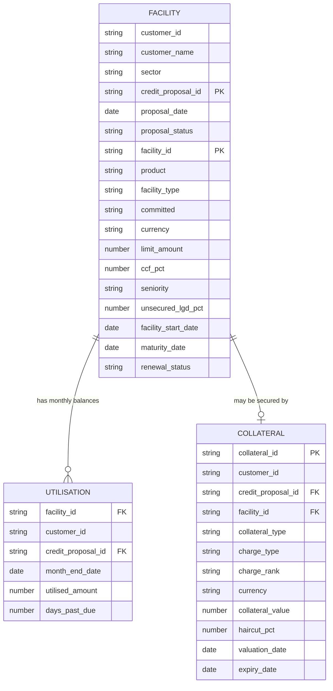
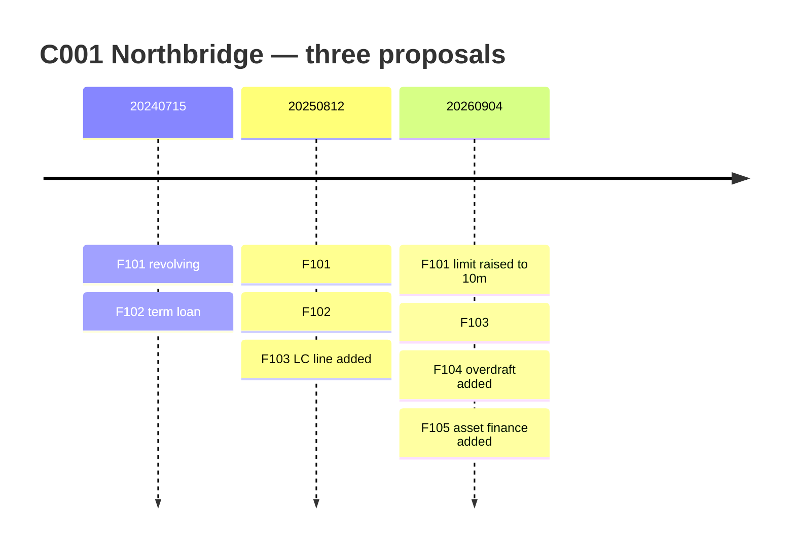

# AI-Powered Limits & Exposure Snapshot + Early Warning Narrative

A Prompt-A-Thon entry. The goal is to turn three raw credit tables into a one-page
exposure snapshot, a trend view, rule-based early warning flags, and a plain-English
"so what" narrative — using a prompt alone, with no code execution.

> All data in this repository is **synthetic**. It was invented for this exercise.
> It contains no real customer, no real bank data, and no production logic.
> Haircuts, CCFs and LGD rates are illustrative assumptions, not policy.

---

## 1. The use case

| | |
|---|---|
| **Scenario** | Risk partners need a fast, consistent view of a client's limits, utilisation, upcoming maturities and early warning signals, without manually stitching together multiple datasets and commentary. |
| **Input** | Synthetic structured risk/exposure data: limits and utilisation by facility, collateral and coverage metrics, and a facility maturity ladder for the next 3–12 months. |
| **Expected output** | One-page exposure snapshot (totals + breakdowns), trend highlights with notable drivers, early warning flags with rationale, and a "so what" impact summary covering refinancing and liquidity risk. |

### Scope decision

**In scope:** EAD, collateral coverage, LGD, loss severity, maturity, early warning flags.

**Out of scope:** internal ratings, PD, expected loss, regulatory capital and RWA.

This matters. Expected loss needs all three parameters:

```
Expected loss = PD x LGD x EAD
```

Without PD we cannot answer *how likely* a default is, so the output answers
*how bad it would be* instead:

```
Loss severity = LGD x EAD
```

That is a legitimate number and it is fully derivable from the data in this repo,
with every step checkable by hand. The prompt must state this scope explicitly,
or the model will invent a rating and a probability.

---

## 2. Glossary

Plain-money definitions for the terms used throughout.

| Term | What it means in money |
|---|---|
| **Limit** | The maximum the bank has approved. Nothing has necessarily moved. |
| **Utilised** | What the customer is actually using right now. For contingent facilities this is the amount *issued*, not cash lent. |
| **Headroom / undrawn** | Limit minus utilised. Promised but not yet taken. |
| **Committed** | The bank is legally obliged to lend the undrawn part on demand. |
| **Uncommitted** | The bank can refuse. Overdrafts usually are. |
| **Revolving** | Take it, repay it, take it again, up to the limit. A credit card. |
| **Term** | Handed over once, repaid to a schedule. Balance only falls. A mortgage. |
| **Contingent** | No bank cash has moved. The bank has promised a third party it will pay if the customer does not. Becomes real money only if called. |
| **CCF** | Credit conversion factor. The share of undrawn headroom assumed to be drawn before default. |
| **EAD** | Exposure at default. The pounds expected to be owed at the moment of failure. |
| **Collateral** | The asset pledged: property, cash, receivables, vehicles. |
| **Charge (fixed / floating)** | The legal claim over that asset. Fixed is locked to a named asset and recovers well. Floating sits over whatever exists at the time and recovers badly. |
| **Haircut** | The discount applied to a valuation before it counts. £10m of property at a 35% haircut counts as £6.5m. |
| **Coverage** | Collateral value divided by utilised amount. |
| **Unsecured LGD** | The loss rate on the part of the exposure collateral does not cover. Around 45% for senior unsecured corporate lending. |
| **Seniority** | Who gets paid first from recoveries. Senior ranks ahead of subordinated, so subordinated LGD is much higher. |
| **Loss severity** | (EAD − collateral after haircut) × unsecured LGD. |
| **Credit proposal** | An application or review. Everything in this model is versioned by it. |

---

## 3. Data model

Three tables. The credit proposal is the version key that ties them together.



### How the credit proposal works

This is the part that makes the dataset realistic, and the part a naive prompt
gets wrong.

- A customer raises **many credit proposals over time**. The ID encodes the
  application date: an application on 15 July 2024 becomes `20240715`.
- **Each proposal lists every facility live for that customer at that moment** —
  not only the ones that changed.
- A **facility keeps the same ID for life**. It reappears on each proposal until
  it matures, then stops appearing.
- Therefore **the latest proposal is the complete current book**, and comparing
  it with the previous proposal gives the trend.



F102 is absent from the third proposal because it matured on 31 July 2026.
Its monthly balances stop at the same point. The two facts must agree.

### Why the tables are split this way

| Fact | Where it lives | Why |
|---|---|---|
| Limit | Facility | Changes only when a proposal changes it, so it belongs with the terms. Repeating it monthly invites contradictions. |
| Utilised amount | Utilisation | Moves every month. |
| Days past due | Utilisation | Behavioural and monthly, like the balance. |
| Haircut | Collateral | An attribute of the pledged asset. |
| Seniority, unsecured LGD | Facility | Applies whether or not collateral exists. A facility with no collateral still needs an LGD. |
| Credit proposal ID | All three | Denormalised onto Utilisation deliberately, so each balance can be matched to the limit in force that month without date-range logic. |

### Collateral rules

- **At most one collateral row per facility.** A property loan has one; a credit
  card or overdraft has none.
- **A facility with no collateral row is unsecured** and takes the full unsecured
  LGD from the facility row.
- **Expiry date matters.** It is blank for collateral that does not expire, such
  as property. Where it is populated, collateral expiring before the facility
  matures should not be relied on.
- **Valuation date matters.** A property valued two years ago is not worth its
  stated value today, and the narrative should caveat it.

---

## 4. Calculation logic

### EAD

| Facility type | Formula |
|---|---|
| Term | `EAD = utilised` |
| Revolving, committed | `EAD = utilised + (ccf_pct x (limit − utilised))` |
| Revolving, uncommitted | `EAD = utilised` (the bank can refuse further drawing) |
| Contingent (guarantee) | `EAD = issued x 100%` |
| Contingent (LC line) | `EAD = issued x 20%` |

The CCF is on the facility row, so the prompt reads it rather than assuming it.

### LGD and loss severity

```
collateral_after_haircut = collateral_value x (1 − haircut_pct)
covered                  = min(EAD, collateral_after_haircut)
uncovered                = EAD − covered
loss_severity            = uncovered x unsecured_lgd_pct
LGD                      = loss_severity / EAD
```

Collateral is counted **only** if it has no expiry date, or its expiry date falls
after the facility maturity date.

Note the two stacked recoveries: the covered portion is recovered by selling the
asset, and the uncovered portion still recovers roughly 55% from the insolvency.
That is why unsecured LGD is 45% and not 100%.

### Convention chosen

Collateral reduces **LGD**. EAD stays gross. The alternative convention — where
collateral reduces EAD directly and LGD stays flat — is equally valid, but the two
must never be combined, or the benefit is double-counted.

### Early warning rules

| Rule | Level | Condition |
|---|---|---|
| High utilisation | Facility | Latest utilisation ÷ limit > 85%, revolving and contingent only |
| Utilisation spike | Facility | Utilisation up more than 10pp month on month |
| Excess over limit | Facility | Utilised > limit |
| Arrears | Facility | Days past due > 0 |
| Maturity without renewal | Facility | Matures within 90 days and renewal status is not "Agreed" |
| Collateral shortfall | Facility | Collateral value ÷ utilised < 100%, where collateral exists |
| Collateral expiry gap | Facility | Collateral expires before the facility matures |

Rules use collateral value **before** haircut. Haircuts are used only in the
recovery maths, so the two views stay separable.

Utilisation rules apply to revolving and contingent facilities only. Term loans
are near fully drawn by design, so a high percentage there is normal, not a warning.

Maturity is a **reporting and early warning dimension only**. It does not change
EAD or LGD. It feeds the regulatory capital formula, which is out of scope here.

---

## 5. What is in the data

`data/credit_exposure_inputs.xlsx` — three sheets.

| Sheet | Rows | Grain |
|---|---|---|
| Facility | 16 | customer × credit proposal × facility |
| Utilisation | 66 | facility × month-end (Oct-2025 to Sep-2026) |
| Collateral | 14 | facility × credit proposal, at most one |

Snapshot date: **30 September 2026**.

### The three customers

| Customer | Proposals | Purpose |
|---|---|---|
| **C001 Northbridge Manufacturing** | 3 | The full story: a maturing facility, a limit increase, two new facilities, arrears, a subordinated exposure |
| **C002 Calder Retail Group** | 2 | A clean comparison case, nothing expiring |
| **C003 Meridian Logistics** | 1 | No prior proposal — tests whether the prompt says "no trend available" instead of inventing one |

### Planted signals

- **F101** climbs from about £6m to £9.5m over three months while its limit rises
  from £8m to £10m in the same month. The narrative must separate drawing more
  from being given more room.
- **F302** is utilised £2.1m against a £2.0m limit — an excess.
- **F104** matures 15 Dec 2026 (76 days out) with renewal not started.
- **F105** is 18 days past due and is the only **subordinated** facility, at 75%
  unsecured LGD, so it should stand out on recovery despite its small size.
- **F202** is flat at £2.4m for all twelve months. It is the control series — any
  trend reported there is a false positive.

### Edge cases the output must handle quietly

- **F102 disappears** from the third proposal and its balances stop, because it
  matured. Both facts must be read consistently.
- **COL005** is a standby LC expiring 31 Aug 2026 securing F103, which runs to
  2028 — an expired security. It is replaced on the current proposal by COL007,
  expiring 2027. Tests whether expiry dates are read or values just summed.
- **F104, F105 and F203** have a single month of history each. No trend exists.
- **Contingent utilisation is issued, not drawn.** Treating an LC line like a cash
  loan overstates exposure fivefold.

---

## 6. Repository layout

```
.
├── README.md                          this document
├── data/
│   └── credit_exposure_inputs.xlsx    the three input tables
└── prompts/                           to be added
```

---

## 7. Next steps

- [ ] **Data generation prompt** — the prompt that produces the three tables, so
      the dataset is reproducible rather than handed over as a file.
- [ ] **Main analysis prompt** — role, scope, the rule table, the calculation
      order, the output template, and guardrails ("use only the data given",
      "show the arithmetic", "write *not provided* rather than estimating").
- [ ] **Answer key** — expected EAD, coverage, LGD, loss severity and flag list
      per facility, so outputs can be scored rather than admired.
- [ ] **Evaluation** — run the prompt several times, score against the answer key
      on accuracy, completeness, traceability and format. Record the false
      positives on the edge cases.
- [ ] **Sensitivity test** — change one haircut, rerun, confirm the recovery
      numbers move correctly and nothing else does.
- [ ] **Output format** — decide between a one-page markdown snapshot and a Word
      pack, and write the template into the prompt.

---

## 8. Design decisions log

Worth keeping, because most of these were arrived at by working through a wrong
version first.

| Decision | Why |
|---|---|
| Drop PD and rating | No rating data available; severity is fully derivable and honest |
| Loss severity, not expected loss | Cannot compute EL without PD; saying so is better than faking it |
| Three tables, not one | Limits, balances and security have different lifecycles |
| Limit on facility, not utilisation | Limits change per proposal, not per month |
| One collateral per facility | Simplicity for the POC; multi-charge is real but adds nothing to the demo |
| No customer-level collateral | Debentures over a whole customer are real and were dropped to keep the joins simple |
| Haircut on the collateral row | It is an attribute of the asset, and it makes the sensitivity test possible |
| Proposal ID on utilisation | Denormalised on purpose, so balances match the right limit without date logic |
| Collateral reduces LGD, not EAD | One convention only, to avoid double-counting the benefit |
